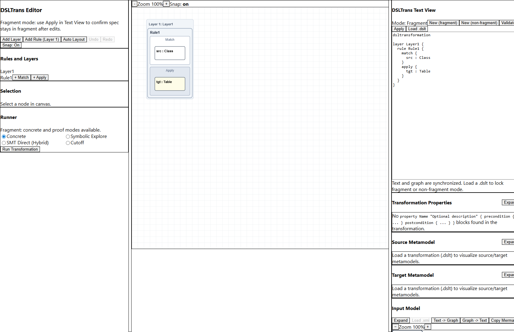
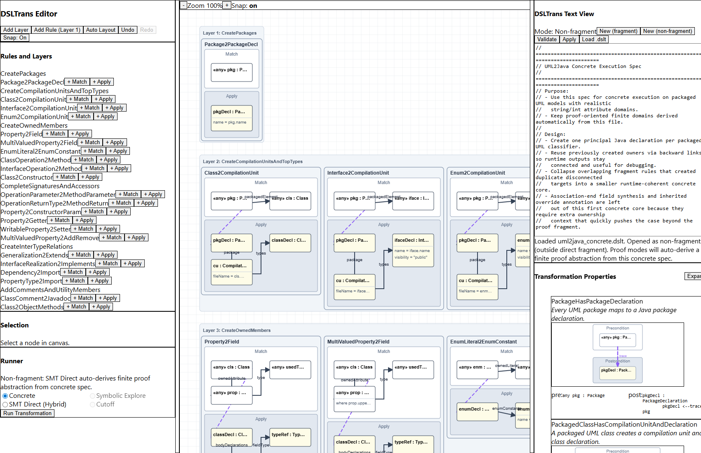
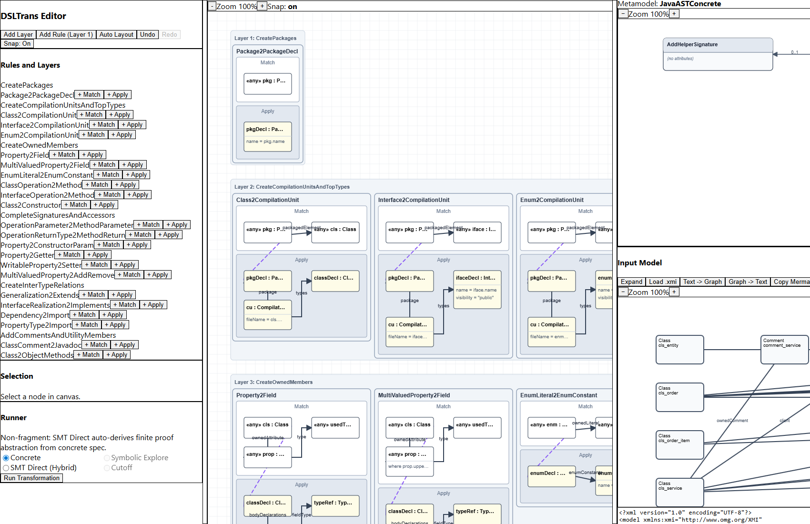
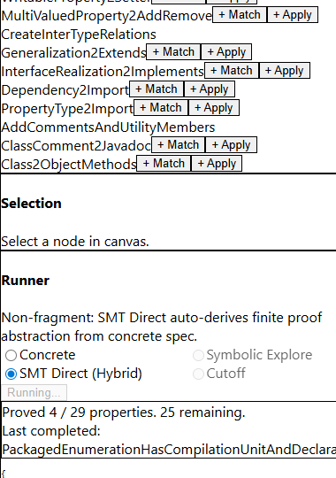

# DSLTrans Web App User Manual

This manual explains how to use the public DSLTrans web application as deployed from this repository.

It covers the main interface areas, the available execution and verification modes, and a concrete walkthrough based on the **UML2Java** example included in the built-in example library.

## 1. What the public web app does

The public web app combines:

- a visual DSLTrans editor
- a DSLTrans text editor
- XMI model loading and visualization
- concrete execution
- SMT-backed verification-oriented runs
- browser-local persistence for your current work
- built-in examples bundled with the application

The goal is to let users move between transformation authoring, concrete execution, and proof-oriented analysis from one interface.

## 2. Interface overview

The application is organized into three main vertical areas.

### Left panel

This side contains the DSLTrans authoring controls, including:

- the **DSLTrans Text View**
- text validation and application controls
- new document creation for fragment and non-fragment work
- built-in example loading in the curated/public version

### Center panel

This is the visual transformation canvas, where you inspect and edit:

- layers
- rules
- match nodes
- apply nodes
- connections between elements

### Right panel

This side contains the execution and analysis views, including:

- transformation properties
- input model
- output model
- source metamodel
- target metamodel
- runner controls

The right-hand side is scrollable.

Important usability note:

- **Load .dslt** appears in the transformation panel controls
- **Load .xmi** appears in the **Input Model** panel on the right, which may require scrolling down before it becomes visible



## 3. Main features

The public deployment supports the following workflows:

1. load a built-in example or import a local `.dslt` transformation
2. inspect and edit the transformation as text and as a graph
3. load or inspect an XMI input model
4. run concrete transformation execution
5. inspect the produced output model as graph and text
6. run proof-oriented analysis modes
7. inspect source and target metamodels
8. export model views as Mermaid text
9. keep the current session state in browser-local storage

## 4. Running example: UML2Java

The easiest way to learn the interface is to use the built-in **UML2Java** example.

### Step 1: Open the application

Open the deployed application in the browser.

If you are working locally instead, start it with:

```bash
cd packages/web-app
npm install
npm start
```

### Step 2: Load the built-in UML2Java example

In the DSLTrans text area, use the built-in example selector and load **UML2Java**.

In the curated/public deployment, this should automatically load:

- the UML2Java DSLTrans transformation
- a representative UML input model when one is bundled for that example

If you prefer, you can also load a local `.dslt` file manually using **Load .dslt**.

### UML2Java transformation loaded



### Step 3: Inspect the transformation

Once loaded, the transformation is shown in two synchronized ways:

- **text form** in the DSLTrans text panel
- **graph form** in the central visual editor

Useful controls in the text view:

- **Validate**: parse-check the transformation text
- **Apply**: parse the text and synchronize the visual graph
- **New (fragment)**: create a fresh fragment document
- **New (non-fragment)**: create a fresh non-fragment document
- **Load .dslt**: import a local transformation file

You can use the text panel for exact editing and the canvas for structural understanding.

## 5. Working with the visual canvas

The center canvas is the structural view of the transformation.

It lets you inspect or edit:

- transformation layers
- rules inside layers
- match and apply nodes
- links between model elements

Typical uses:

- understand the structure of a loaded transformation quickly
- move visual elements for readability
- create or reorganize rules during authoring
- compare the text and graph representations of the same transformation

For precise edits, text mode is usually best. For orientation and structure, the canvas is often better.

## 6. Loading and inspecting input models

The **Input Model** panel is on the right.

To load a local model:

1. scroll to the **Input Model** section
2. click **Load .xmi**
3. choose an XMI file compatible with the loaded transformation source metamodel

Once loaded, the panel shows:

- a graph representation of the input model
- the underlying XMI text

The model panel also provides:

- **Text -> Graph**: parse the text area into the graph view
- **Graph -> Text**: serialize the current graph back into XMI text
- **Copy Mermaid**: copy a Mermaid representation for documentation or further inspection
- **Expand**: open the panel in a larger overlay view

### Input model panel and right-hand workflow



## 7. Running the transformation

Use the **Runner** panel to execute the loaded transformation.

Select a mode, then click **Run Transformation**.

### Concrete

This is the normal first step.

Use **Concrete** when you want to:

- execute the transformation on the loaded input model
- produce a concrete output model
- inspect the output directly

After a successful run:

- the runner returns a result payload
- the **Output Model** panel is updated with the generated model

### Symbolic Explore

Use **Symbolic Explore** for fragment-compatible transformations when you want a bounded symbolic run rather than one concrete execution.

### SMT Direct (Hybrid)

Use **SMT Direct (Hybrid)** when you want proof-oriented analysis backed by SMT solving.

This is the most important proof-oriented mode in the public app, especially for transformations that are not directly inside the restricted proof fragment.

During execution the app displays progress, including:

- completed properties
- remaining properties
- last completed property

### Proof-oriented run in progress



### Cutoff

Use **Cutoff** for fragment-compatible proof analysis based on cutoff reasoning.

## 8. Fragment vs non-fragment documents

The app classifies loaded transformations into one of two categories.

### Fragment

A fragment transformation stays within the directly supported proof fragment.

In this case:

- concrete execution is available
- Symbolic Explore is available
- SMT Direct is available
- Cutoff is available

### Non-fragment

A non-fragment transformation falls outside the directly supported fragment.

In this case:

- concrete execution is still available
- SMT Direct remains available
- Symbolic Explore and Cutoff are disabled
- proof-oriented checking goes through an automatically derived finite proof abstraction

This is normal behavior, not a failure.

## 9. Output model and metamodel inspection

### Output Model panel

After a concrete run, inspect the generated target model in the **Output Model** panel.

As with the input panel, you can:

- switch between graph and text
- export Mermaid
- expand for a larger view

### Source and Target Metamodel panels

These panels become useful after loading a transformation.

They help you understand:

- what source model shape the transformation expects
- what target model shape it produces
- whether the selected XMI input makes sense for the loaded transformation

## 10. Local persistence

The public app stores the current working session in the browser, including:

- the current DSLTrans specification
- the current input XMI text
- the current output XMI text

This means a page refresh usually preserves the current state on the same browser.

It is browser-local persistence, not backend persistence.

## 11. Typical end-to-end workflow

A practical first session usually looks like this:

1. open the app
2. load the built-in **UML2Java** example
3. inspect the transformation text and canvas structure
4. scroll down to the **Input Model** panel and confirm the model is loaded
5. run **Concrete**
6. inspect the **Output Model** panel
7. run **SMT Direct (Hybrid)** for proof-oriented checking
8. inspect the returned property results and proof progress

## 12. Tips for effective use

- Start with **Concrete** mode before proof-oriented modes
- If you do not see **Load .xmi**, scroll further down in the right-hand panel
- Use **Validate** before **Apply** when editing transformation text manually
- Use **Expand** when inspecting larger models or metamodels
- Use **Copy Mermaid** when documenting a model view externally
- If a transformation is classified as **Non-fragment**, use **SMT Direct (Hybrid)** for proof-oriented runs

## 13. Troubleshooting

### I loaded a transformation but cannot load a model

The input model loader is metamodel-aware. Check that:

- the transformation was loaded successfully first
- the XMI conforms to the expected source metamodel

### Proof modes are disabled

This usually means the transformation is outside the directly supported proof fragment. In that case, use:

- **SMT Direct (Hybrid)**

### The graph does not match the text

Try:

- **Apply** in the DSLTrans text panel
- **Text -> Graph** in the model panel

### My work disappears after changing browser or machine

Persistence is local to the current browser. If you want portability, export or save your files explicitly.

## 14. Recommended first example

If you want one representative example, start with **UML2Java**.

It demonstrates almost the full flow:

- transformation loading
- input model loading
- visual inspection
- concrete execution
- proof-oriented analysis
- input/output/metamodel inspection
